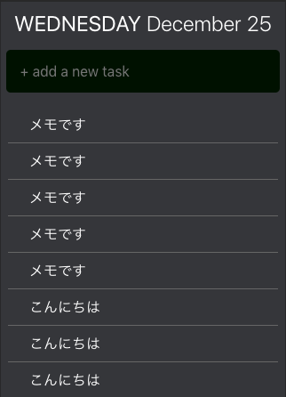

# nuxt-todo-app

Nuxt.jsで実装したTODOアプリです。



# デモサイト

https://young-castle-95625.herokuapp.com/

# Required

* Node.js >= 8
* SQLite

## Build Setup

``` bash
# install dependencies
$ npm install

# データベースの作成
$ npx sequelize-cli db:migrate

# serve with hot reload at localhost:3000
$ npm run dev

```

Build Setupを実行後に `http://localhost:3000` にアクセスすると表示されます。
